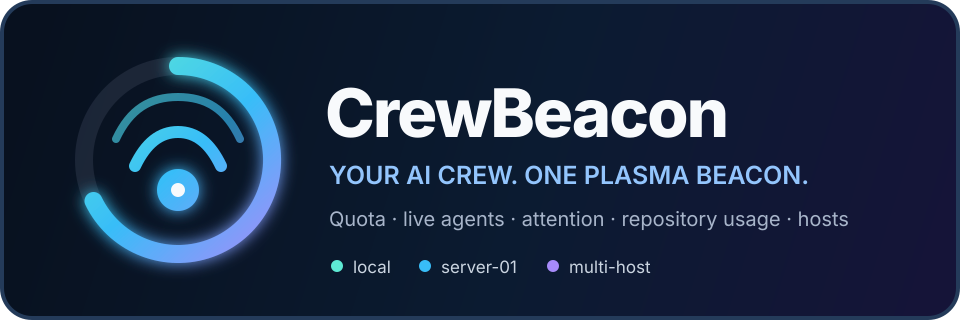

<p align="center">
  
</p>

<p align="center">
  <b>Your AI crew. One Plasma beacon.</b><br>
  A KDE Plasma 6 widget that combines AI quota, live local and remote coding
  agents, explicit attention states, and repository-level usage accounting.
</p>

<p align="center">
  <a href="LICENSE"></a>
  
  
  
</p>

<p align="center">
  <a href="#-install">Install</a> ·
  <a href="#-setup">Setup</a> ·
  <a href="#-features">Features</a> ·
  <a href="#-accuracy">Accuracy</a> ·
  <a href="#-development">Development</a>
</p>

---

## ✨ Features

| | |
|---|---|
| 🚨 **Attention first** | Explicit input, permission, and failure states appear above routine telemetry. Notifications are durably deduplicated across reconnects and Plasma restarts. |
| 🤖 **Compact crew overview** | Filterable two-line cards merge Paseo agents with active local Claude/Codex editor and CLI sessions. VS Code sessions are labeled explicitly and open their workspace on click. |
| 🌐 **Server-first** | Observe local Paseo, a dedicated development server, and additional hosts through independent direct or official relay sources. One source failing does not blank the others. |
| 📅 **Daily usage history** | A 371-day calendar heatmap opens each local day into repository, provider/model, session, and individual-call detail. Recent local Claude/Codex usage is imported incrementally. |
| ⏱️ **Provider quota** | Claude, Codex, Copilot, and Gemini detection; usage windows; reset times; plan details; stale-data fallback; ring/bar modes; and quota alerts built into CrewBeacon. |
| 🎛️ **Weekly panel rings** | Show every visible provider with a primary weekly limit side by side in the panel; Claude and Codex marks can replace center percentages. |
| 🎨 **Shared visual language** | The bounded popup, navy palette, compact cards, chips, spacing, and optional system-theme mode follow OctoPulse. |
| 🧭 **Stable attribution** | SSH and HTTPS forms of the same Git remote normalize to one logical repository while workspaces remain distinct. Path-only fallbacks are namespaced by host. |
| 📴 **Last-known state** | Host and session snapshots survive widget reloads and remote disconnects. Offline data is marked stale instead of disappearing. |
| 🔒 **Conservative security** | No prompt text is persisted by default. Relay pairing secrets live in user-owned `0600` files and are consumed by the official Paseo CLI, never copied into Plasma configuration. |

## 📦 Install

### Arch / CachyOS (AUR)

```sh
yay -S crewbeacon
```

### From source

```sh
git clone https://github.com/Conqrex/Conqrex.CrewBeacon.git
cd Conqrex.CrewBeacon
./install.sh
```

Then right-click the desktop or panel → **Add Widgets** → search for
**CrewBeacon**.

Reload Plasma after upgrading a placed development copy:

```sh
kquitapp6 plasmashell && kstart plasmashell
```

Package ID: `com.conqrex.crewbeacon`

## 🔧 Setup

### Local Paseo

The default source is already configured:

```text
Local Paseo · ws://127.0.0.1:6767/ws
```

Paseo must be running. CrewBeacon performs the protocol handshake, verifies a
`0.2.x` daemon, subscribes to session/workspace updates, and never sends agent
control requests.

### Local editors and CLIs

Local Claude and Codex sessions are enabled independently of Paseo under
**CrewBeacon settings → General → CrewBeacon agents**. Codex activity is read
from recent rollout metadata, including VS Code sessions. Claude live state uses
the optional hooks available on the same settings page.

CrewBeacon can also import provider-reported token counters from recent
`~/.codex/sessions` and `~/.claude/projects` JSONL files. The importer is
incremental, byte-bounded, and deduplicated. It reads session/repository/model
metadata and usage counters only; prompt and response bodies are never inserted
into CrewBeacon's database. The backfill window is configurable from 1–30 days.

### Dedicated server through the Paseo relay

On the machine running the daemon, generate the same offer used by the web and
mobile clients. Save it locally without printing it or placing it in shell
history:

```sh
mkdir -p ~/.local/share/crewbeacon
chmod 700 ~/.local/share/crewbeacon
paseo daemon pair --json | jq -r .url \
  | install -m 600 /dev/stdin ~/.local/share/crewbeacon/paseo.offer
```

Open **CrewBeacon settings → Hosts**, add a source, choose **Encrypted Paseo
relay**, and select that offer file. CrewBeacon invokes an installed official
Paseo CLI every 20 seconds. The CLI handles the offer and end-to-end encrypted
relay protocol; the secret URL is passed through `PASEO_HOST`, not the process
command line.

Relay polling currently exposes basic agent identity, provider/model, working
directory, and lifecycle state. Direct WebSockets remain the richer path for
workspace metadata, explicit permission/input evidence, and completed-turn
usage events.

### Direct SSH-forward fallback

Keep the remote daemon bound to its loopback interface. Forward it securely:

```sh
ssh -N -L 16767:127.0.0.1:6767 your-server
```

Open **CrewBeacon settings → Hosts**, add a source, and use:

```text
ws://127.0.0.1:16767/ws
```

Each host can use its own forwarded port. A private, correctly authenticated
`wss://HOST/ws` boundary is also accepted. Do not publish an unauthenticated
Paseo daemon or put a password in the endpoint/configuration string.

## 🧩 What each tab means

The bounded expanded view keeps two jobs separate:

1. **Overview** — attention, a filterable live-agent list, remaining provider quota, and source health.
2. **Usage** — a local-time monthly calendar and selected-day drill-down by repository, provider/model, session, and recorded turn.

Silence never becomes “waiting for input.” CrewBeacon requires an explicit
Paseo question/permission/attention event.

## 🎯 Accuracy

CrewBeacon never converts quota percentages or context occupancy into token
consumption.

| Data | Treatment |
|---|---|
| Paseo `turn_completed` input/output tokens | Persisted as provider-reported event deltas and included in history |
| Codex local cumulative counters | Only positive counter advances are persisted; repeated snapshots are ignored |
| Claude local request usage | Deduplicated by provider request ID before persistence |
| Cache-read tokens | Stored and displayed independently; not added again to input+output totals |
| Paseo reported cost | Stored with USD provenance when present; never price-estimated silently |
| Context used / maximum | Current context detail only; excluded from historical totals |
| Agent `lastUsage` snapshot | Labeled as last-turn/current detail; never summed across refreshes |
| Missing provider fields | Hidden or shown as unavailable, never replaced with zero |
| Quota windows | Displayed only under Quota; never interpreted as token usage |

Paseo `0.2.5` does not expose a historical stream of missed per-turn usage
deltas via the directory snapshot, so relay snapshots are never converted into
usage. Local Claude/Codex logs provide a separate, bounded backfill path when
enabled. See the exact [protocol evidence](docs/PASEO-PROTOCOL.md).

## 🖥️ Requirements

| Component | Purpose | Required |
|---|---|---|
| KDE Plasma 6 | Widget host | ✅ |
| Qt WebSockets QML module | Paseo live transport | ✅ |
| Python 3 | Standard-library SQLite persistence helper | ✅ |
| `bash`, `curl`, `jq`, `flock` | Existing quota adapters/cache | ✅ |
| Official Paseo CLI with `ls --host` | Encrypted offer-link relay snapshots | for relay sources |
| KDE notifications | Attention and quota alerts | optional |
| Claude/Codex/Copilot sign-in | Corresponding quota data | per provider |

Local data lives at:

```text
${XDG_DATA_HOME:-~/.local/share}/crewbeacon/crewbeacon.sqlite3
${XDG_CACHE_HOME:-~/.cache}/crewbeacon-usage-*.json
${XDG_CACHE_HOME:-~/.cache}/crewbeacon-claude-activity/
```

Attention previews are not persisted unless explicitly enabled. Credentials
remain in provider-owned stores; CrewBeacon does not copy them into its config.

## 🛠️ Development

The project has no compile step. Run the complete local suite:

```sh
./tests/run.sh
```

It covers quota normalization/formatting, Paseo message/state normalization,
unknown-message tolerance, reconnect bounds, attention and usage deduplication,
remote normalization/worktree grouping, context-vs-cumulative safety, local
log import cursors, day/week/month rollups, partial metrics, persistence, and
QML/static validation.

Preview without restarting Plasma:

```sh
plasmoidviewer -a ./package -f planar -l floating
```

Technical documentation:

- [Design](docs/DESIGN.md)
- [Paseo protocol compatibility](docs/PASEO-PROTOCOL.md)

## 🛰️ Sibling projects

- [**OctoPulse**](https://github.com/Conqrex/Conqrex.OctoPulse) — GitHub Actions monitoring from the Plasma panel.
- [**Dockswain**](https://github.com/Conqrex/Conqrex.Dockswain) — Docker host management over SSH.
- [**MemoKeel**](https://github.com/Conqrex/Conqrex.MemoKeel) — notes, to-dos, kanban and reminders in one local-first panel popup.

## 📄 License

[MIT](LICENSE) © Serhan Aydinicen
